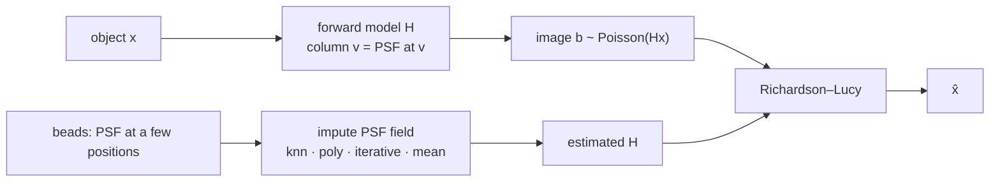

# jrl-impute

Spatially varying Richardson–Lucy deconvolution in which the PSF is **measured at a few beads** and
**imputed everywhere else**.



## Layout

| Path | What |
|---|---|
| [`jrl_impute.py`](jrl_impute.py) | **Maintained pipeline**, a single self-contained module: PSF model → sparse `H` → bead mask → imputation → RL → demo CLI |
| [`tests/`](tests/test_pipeline.py) | `pytest -q` (~1 s): forward-model correctness, RL, imputers, end-to-end ranking |
| [`proofs/psf_field_proofs.py`](proofs/psf_field_proofs.py) | Gist-style numerical checks of every result in `docs/PROOFS.md` |
| [`docs/RESEARCH.md`](docs/RESEARCH.md) | Literature and a principled design: PSF-field models, blind deconvolution, STED/SIM |
| [`docs/PROOFS.md`](docs/PROOFS.md) | Proofs: smoothness of coefficients, PCA optimality, interpolation bounds, identifiability |
| [`docs/scratchpad.md`](docs/scratchpad.md) | Log of the research framing and questions |
| `simulate_demo*.py`, `richardson_lucy.py`, `nn_model.py`, `airy_get_psf.py`, `notebooks/` | **Legacy** exploration (2019–2021). Imports patched for current numpy/scipy/sklearn; keras scripts still need keras 2 |

## Quick start

```bash
pip install -r requirements.txt
pytest -q
python jrl_impute.py --plot demo.png          # 64×64, 100 beads, ~4 s
python proofs/psf_field_proofs.py             # verifies docs/PROOFS.md, ~6 s
```

Demo output (seed 0, 64×64, 9×9 PSFs, 100 of 4096 PSFs known, 200 photons):

| run | SSIM | NRMSE | PSF error on imputed pixels |
|---|---|---|---|
| blurred | 0.604 | 0.254 | |
| RL, true H | 0.729 | 0.187 | 0 |
| RL, **knn**-imputed H | **0.727** | **0.191** | 0.067 |
| RL, poly-imputed H | 0.715 | 0.200 | 0.104 |
| RL, iterative-imputed H | 0.691 | 0.221 | 0.302 |
| RL, mean PSF (spatially invariant) | 0.691 | 0.221 | 0.302 |

- Spatial imputation recovers almost all of the gap between a spatially invariant PSF and the true field.
- `IterativeImputer` (the original approach) reduces to the mean PSF here. Each PSF pixel gets regressed on other, mean-filled pixels, and a radially symmetric field has no linear trend in position for it to use.

## Known issue fixed

The legacy scripts store the point response of pixel `i` in **row** `i`, which builds `Hᵀ`, not `H`.
The two agree only for a single symmetric PSF. `jrl_impute.forward_matrix` builds columns, and
`tests/test_pipeline.py::test_varying_forward_matrix_columns_are_point_responses` guards it.
The legacy lines carry an `NB:` comment.

## Where this is going

See [`docs/RESEARCH.md`](docs/RESEARCH.md). In short:

- **Represent the PSF field physically.** Use Zernike coefficients whose field dependence is a low-order Hopkins polynomial, plus a non-parametric residual.
- **Run the operator as a product-convolution**, `Σ e_i ⊛ (c_i·x)`.
- **Use defocus diversity** to make blind/self-calibrated estimation identifiable.
