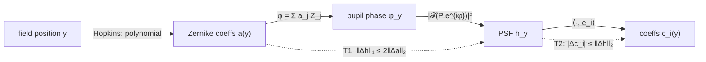

# PSF-field proofs

> **Scope.** Short, self-contained results about representing a spatially varying PSF
> field and interpolating it between beads. Each result is checked numerically by
> [`proofs/psf_field_proofs.py`](../proofs/psf_field_proofs.py) (numpy + scipy, ~6 s, asserts every bound).
> Context and literature are in [`RESEARCH.md`](RESEARCH.md).

---

## 0. Setup and notation

| Symbol | Meaning |
|---|---|
| `y ∈ Ω ⊂ ℝ²` | field position (the source/object pixel) |
| `h_y` | PSF of a point source at `y`: non-negative, `‖h_y‖₁ = 1` |
| `H` | forward operator, `(Hx)(p) = Σ_v x(v) · h_v(p − v)`. **Column** `v` of `H` is `h_v` centred on `v` |
| `P(ρ)` | pupil amplitude; `φ_y(ρ)` pupil phase at field position `y` |
| `Z_j` | Zernike polynomials, orthonormal w.r.t. the pupil weight `|P|²/‖P‖²` |
| `a(y) ∈ ℝ^J` | Zernike coefficients, `φ_y = Σ_j a_j(y) Z_j` |
| `{e_i}` | any fixed orthonormal basis of PSF space (pixels, PCA, Zernike-derived, …) |
| `c_i(y) = ⟨h_y, e_i⟩` | basis coefficients of the PSF at `y` |

**Scalar pupil model** (unitary DFT `𝓕`):

```
u_y = 𝓕[ P · exp(i φ_y) ],     h_y = |u_y|² / ‖P‖₂²      (Parseval ⇒ ‖h_y‖₁ = 1)
```

> **Row versus column.** The legacy scripts wrote the point response of pixel `i` into
> **row** `i`, which builds `Hᵀ`. That equals `H` only for a single symmetric PSF. With a
> varying PSF, Richardson–Lucy was therefore run with the wrong operator. The fix is
> `jrl_impute.forward_matrix`, with a regression test in `tests/test_pipeline.py`.



---

## T1. Phase to PSF is 2-Lipschitz (L1 PSF vs RMS phase)

**Claim.** For any two phases `φ, φ'` on the same pupil,

```
‖h − h'‖₁  ≤  2 · RMS_P(φ − φ')         where RMS_P(ψ)² = Σ |P|² ψ² / Σ |P|²
```

With Zernikes orthonormal on the pupil, `RMS_P(φ_y − φ_y') = ‖a(y) − a(y')‖₂`, so

```
‖h_y − h_y'‖₁  ≤  2 ‖a(y) − a(y')‖₂ .
```

**Proof.**
1. Pointwise: `| |u|² − |u'|² | = | |u| − |u'| | · (|u| + |u'|) ≤ |u − u'| · (|u| + |u'|)`.
2. Sum and apply Cauchy–Schwarz: `Σ | |u|² − |u'|² | ≤ ‖u − u'‖₂ (‖u‖₂ + ‖u'‖₂) = 2 ‖P‖₂ ‖u − u'‖₂` (Parseval: `‖u‖₂ = ‖P‖₂`).
3. `𝓕` is unitary, so `‖u − u'‖₂ = ‖P (e^{iφ} − e^{iφ'})‖₂`, and `|e^{iα} − e^{iβ}| = 2|sin((α−β)/2)| ≤ |α − β|`.
4. So `‖u − u'‖₂ ≤ ‖P(φ − φ')‖₂ = ‖P‖₂ · RMS_P(φ − φ')`. Dividing step 2 by `‖P‖₂²` gives the claim. ∎

**Remarks.**
- The bound is in **L1**, the natural norm for PSFs (probability densities) and for flux-preserving Richardson–Lucy.
- *Numerically* the bound holds with a worst-case ratio ≈ 0.51 and a median ≈ 0.40. It is loose by about a factor of 2 but has the right scaling.
- It uses only the pupil model. It does **not** need small aberrations and holds for any `P` (apodised, vortex, …), which matters for STED ([RESEARCH.md §6](RESEARCH.md#6-hard-to-measure-psfs-sted-and-sim)).

---

## T2. Any fixed orthonormal basis inherits the field's smoothness (your conjecture)

**Claim.** Let `{e_i}` be *any* fixed orthonormal basis, PCA included, and `c_i(y) = ⟨h_y, e_i⟩`. Then

```
|c_i(y) − c_i(y')|  ≤  ‖h_y − h_y'‖₂  ≤  ‖h_y − h_y'‖₁            (each i)
Σ_i |c_i(y) − c_i(y')|²  =  ‖h_y − h_y'‖₂²                         (Parseval)
```

If `y ↦ h_y` is differentiable, `∂^α c_i(y) = ⟨∂^α h_y, e_i⟩`, so every Sobolev or Hölder norm of `c_i` is bounded by the same norm of the vector-valued field `y ↦ h_y`.

**Proof.** `c_i(y) − c_i(y') = ⟨h_y − h_y', e_i⟩`. Apply Cauchy–Schwarz with `‖e_i‖₂ = 1`, and use `‖·‖₂ ≤ ‖·‖₁` on vectors. Parseval gives the sum. Differentiation commutes with the bounded linear functional `⟨·, e_i⟩`. ∎

**Corollary (T1 + T2).** If `a(·)` is `L_a`-Lipschitz, then every coefficient field is Lipschitz:

```
|c_i(y) − c_i(y')|  ≤  2 L_a |y − y'| .
```

**What this does *not* give you.** Smoothness is inherited, but **polynomial structure is not**.
`a(y)` is a low-order polynomial (Hopkins, §T6), yet `c_i(y)` is a nonlinear function of `a(y)`.
Numerically, fitting a cubic to PCA coefficients plateaus at about 38% field error, while fitting the
cubic in the *Zernike* domain reaches below 1% (T6).

> **Caveat: local PCA.** The claim is for a **global, fixed** basis. If you run PCA per tile, eigenvectors
> can flip sign or swap order between tiles, so the coefficients are *not* continuous across tile edges.

---

## T3. PCA of the whole field is the Hilbert–Schmidt-optimal product-convolution model

A rank-`r` **product-convolution** model is `h̃_v = Σ_{i≤r} c_i(v) e_i`, i.e.

```
H̃ x  =  Σ_{i≤r}  e_i ⊛ (c_i · x)          (T4: convolve each basis PSF with a weighted image)
```

**Claim (periodic boundary; with zero/cropped boundary the equalities become `≤`).**

```
‖H − H̃‖_F²      =  Σ_v ‖h_v − h̃_v‖₂²                      (HS identity)
‖H − H̃‖_{1→1}   =  max_v ‖h_v − h̃_v‖₁                     (max column sum)
min over rank-r (e, c) of ‖H − H̃‖_F²  =  Σ_{i>r} σ_i²(M),   M = [h_v]_v  (k² × N)
```

and the minimiser is `e_i` = the top-`r` left singular vectors of the **full-field** PSF matrix `M`,
`c_i(v) = ⟨h_v, e_i⟩`.

**Proof.** Column `v` of `H − H̃` is a (periodically) shifted copy of `h_v − h̃_v`; shifting is a
permutation, so it preserves both `ℓ2` and `ℓ1`. Summing squared columns gives the Frobenius (HS)
norm; the max column `ℓ1` sum is the `1→1` operator norm. The HS objective is then
`‖M − E C‖_F²` with `rank(EC) ≤ r`, which the Eckart–Young–Mirsky theorem solves by truncated SVD. ∎

**Consequences.**
- PCA is **not unprincipled**. It is exactly the optimal *linear* low-rank operator approximation in HS norm, *provided* it is computed over the whole field with uniform weight, not over whatever positions the beads happened to land on.
- Beads give a *non-uniform sample* of `M`. PCA on beads estimates the full-field SVD, and is biased towards regions dense in beads.
- **The catch:** the PSF field is a curved 2-D surface through pixel space, so its linear rank grows quickly. With moderate aberrations (≈1 rad RMS at the edge), rank 8 still leaves **27%** HS error (script output). A basis built from the Zernike Jacobian at the field centre is worse at every rank (T3 asserts `PCA ≤ Jacobian`).
- HS controls the `ℓ2` operator norm (`‖·‖₂ ≤ ‖·‖_F`), and the `1→1` norm is controlled by the worst-case per-PSF L1 error. For the `ℓ2` norm there is also Schur's bound, `‖E‖₂ ≤ √(‖E‖_{1→1} ‖E‖_{∞→∞})`.

---

## T4. Product-convolution operator and adjoint (what Richardson–Lucy needs)

```
H x   = Σ_i  e_i ⊛ (c_i · x)             (convolve weighted images)
Hᵀ y  = Σ_i  c_i · (e_i ⋆ y)             (correlate, then weight)
```

- Cost: `r` FFT pairs per application instead of a `k²N`-entry sparse matrix.
- This is the **column-varying** ("sum of convolutions of weighted images") form. It is the one that matches `H` above. The other ordering, `Σ_i c_i · (e_i ⊛ x)`, is **row-varying**. It models PSFs indexed by *detector* position and is the transpose-type model: the same `Hᵀ` confusion as in the legacy code.
- Checked against the dense operator for `r ∈ {1, 2, 3, 5, 8}` (`pc_apply`, `pc_adjoint`).

---

## T5. Interpolation error from beads

**Claim.** Let `X` be the bead positions, `nn(y)` the nearest bead, and `L_a = sup_y ‖Da(y)‖_op`. Then

```
‖h_y − h_{nn(y)}‖₁  ≤  2 L_a |y − nn(y)|  ≤  2 L_a · fill_distance(X)
```

and any **convex-combination** interpolator `h̃_y = Σ_b w_b(y) h_b` (`w ≥ 0`, `Σ w = 1`: nearest neighbour, inverse-distance kNN, bilinear on a bead grid) obeys the same bound, with `|y − nn(y)|` replaced by the largest distance to a bead that gets non-zero weight.

**Proof.** Apply T1 along the segment from `y` to `y'` (the domain is convex). For convex combinations, `‖h_y − Σ w_b h_b‖₁ ≤ Σ w_b ‖h_y − h_b‖₁` by the triangle inequality. ∎

**Remarks.**
- Convex combinations **preserve positivity and unit mass**, which a Poisson/RL solver needs. Polynomial, kriging and RBF interpolants in pixel or PCA space do not; they need clipping and renormalisation.
- This is first order: error ∝ bead spacing. Higher-order interpolants (thin-plate splines, kriging, moving least squares) reach `O(h^s)` for `H^s`-smooth fields (Wendland 2004), but lose positivity.
- Interpolating PSF **pixels** and interpolating **coefficients of a full basis** with the *same linear* interpolator give *identical* results. The basis only matters once you **truncate** it (denoising/compression) or change the *model class* (T6). So `jrl_impute.impute_psfs(method="knn")` is already "coefficient interpolation".

---

## T6. Identifiability and the parametric (physics) fit

**Twin-image ambiguity (exact).** Write `φ = φ_even + φ_odd` (parity under `ρ → −ρ`). With a
centro-symmetric real pupil `P`, the phase `φ̌(ρ) = −φ(−ρ) = −φ_even + φ_odd` gives

```
𝓕[P e^{iφ̌}] = conj(𝓕[P e^{iφ}])   ⇒   h(φ̌) = h(φ)   exactly.
```

So from **in-focus** intensity alone, the signs of all even Zernikes (defocus, astigmatism, spherical,
…) are unidentifiable, whether from beads or blind. Adding a *known* defocus `δ Z₄` to both breaks the
symmetry, because `δ Z₄` is even and does not flip. This is **phase diversity** (Gonsalves 1982;
Paxman et al. 1992). Numerically: in-focus twin difference is `5.6e-17`; with `δ = ±1 rad` it is `‖Δh‖₁ ≈ 0.92`.

**Parametric field fit.** Hopkins' wave-aberration expansion makes the field dependence of each
Zernike coefficient a **low-order polynomial in `y`**. To third (Seidel) order: defocus
`∝ const + |y|²`, astigmatism `∝ |y|²` (orientation `2ψ`), coma `∝ |y|` (orientation `ψ`),
spherical `∝ const`, distortion (tilt) `∝ |y|³`. So the whole field has **~5 parameters**, not
`N × k²`.

| Model (script output, 32×32 field, 21×21 PSFs) | beads | field rel. L2 error |
|---|---|---|
| Hopkins 5-parameter fit, ±1 rad diversity, 2×10⁴ photons/bead | **8** | **0.6%** |
| same, **misspecified** (truth has an extra `0.6|y|⁴` field curvature) | **8** | **8.6%** |
| non-parametric kNN (convex combination), same misspecified field | 8 / 50 / 200 | 64% / 35% / 20% |
| PCA-8 + cubic polynomial on coefficients (well-specified field) | 200 | 38% (truncation floor) |

**Reading.**
- When a physics model is roughly right, it beats non-parametric interpolation by an order of magnitude or more in bead count.
- Under misspecification the parameters *absorb* the missing term: defocus drifts from 0.3 to 0.03 and curvature from 1.0 to 1.97. So a fitted parameter should be read as a *parameter*, not as a physical measurement.
- The principled fix is a **hybrid**: parametric physics plus a non-parametric residual (kNN/GP on residual PSFs or residual phase). Its error then goes to zero as beads increase (see [RESEARCH.md §4](RESEARCH.md#4-recommended-model-physics-first-hybrid-psf-field)).

---

## Summary

| # | Statement | Status |
|---|---|---|
| T1 | `‖Δh‖₁ ≤ 2 RMS(Δφ) = 2‖Δa‖₂` | **proved** + checked |
| T2 | fixed-basis coefficients are as smooth as the PSF field (Lipschitz, Sobolev); Parseval | **proved** + checked |
| T3 | full-field SVD = HS-optimal rank-r product-convolution; HS and `1→1` identities | **proved** + checked |
| T4 | `H = Σ e_i ⊛ (c_i·)`, `Hᵀ = Σ c_i·(e_i ⋆)` | **proved** + checked |
| T5 | convex-combination interpolation error ≤ `2 L_a` × bead distance | **proved** + checked |
| T6 | in-focus twin ambiguity is exact; diversity breaks it; Hopkins fit is data-efficient | **proved** (twin) / **empirical** (fit) |

*Assumptions throughout:* scalar pupil model (no vectorial/high-NA polarisation effects); a 2-D field
(no depth dependence); PSF translation (distortion) handled separately by registration; periodic boundary for the equalities in T3.
