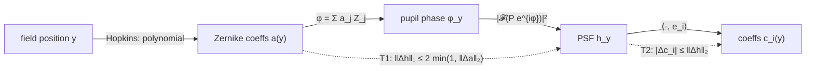

# PSF-field proofs

> **Scope.** Short, self-contained results about representing a spatially varying PSF
> field and interpolating it between beads. Each result is checked numerically by
> [`proofs/psf_field_proofs.py`](../proofs/psf_field_proofs.py) (numpy + scipy, ~10 s, asserts every bound).
> Context and literature are in [`RESEARCH.md`](RESEARCH.md). Controlled comparisons are in [`EXPERIMENTS.md`](EXPERIMENTS.md).
> *Revision 2:* claims narrowed after an adversarial review. The changes are listed at the end.

---

## 0. Setup and notation

| Symbol | Meaning |
|---|---|
| `y ∈ Ω ⊂ ℝ²` | field position (the source/object pixel); `Ω` convex |
| `h_y` | PSF of a point source at `y`: non-negative, `‖h_y‖₁ = 1` (before any cropping) |
| `H` | forward operator, `(Hx)(p) = Σ_v x(v) · h_v(p − v)`. **Column** `v` of `H` is `h_v` centred on `v` |
| `P(ρ)` | pupil amplitude; `φ_y(ρ)` pupil phase at field position `y` |
| `Z_j` | Zernike polynomials (Noll). In the script they are **Gram–Schmidt re-orthonormalised on the discrete pupil** in the order j = 4, 5, 6, 7, 8, 11, so `RMS_P(Σ a_j Z_j) = ‖a‖₂` holds exactly |
| `a(y) ∈ ℝ^J` | Zernike coefficients, `φ_y = Σ_j a_j(y) Z_j` (piston and tip/tilt excluded) |
| `{e_i}` | any fixed orthonormal basis of PSF space (pixels, SVD, Zernike-derived, …) |
| `c_i(y) = ⟨h_y, e_i⟩` | basis coefficients of the PSF at `y` |

**Scalar pupil model** (unitary DFT `𝓕`):

```
u_y = 𝓕[ P · exp(i φ_y) ],     h_y = |u_y|² / ‖P‖₂²      (Parseval ⇒ ‖h_y‖₁ = 1 on the full DFT grid)
```

> **Legacy operator.** The legacy scripts set `L[i, :] = convolve(δ_i, h_i)`, i.e. `L[i, p] = h_i(p − i)`.
> That is the **row-varying** model with flipped kernels, and it equals `Hᵀ` of the column-varying model.
> `L = H` requires a *single* PSF that is centrosymmetric about a pixel centre, which means odd support.
> The legacy code never met that condition:
> - `simulate_demo_variable_psf.py` uses an even 16×16 kernel, which is half a pixel off-centre.
> - It uses `ndimage.convolve` with its default `mode='reflect'`.
> - Its PSFs are unnormalised (sum ≈ 6.3).
>
> `jrl_impute.forward_matrix` builds columns (odd support, zero boundary, unit-mass PSFs). For *any*
> single PSF, symmetric or not, it equals `ndimage.convolve(x, psf, mode="constant")`.



---

## T1. Phase to PSF is 2-Lipschitz (L1 PSF vs RMS phase)

**Claim.** For any two phases `φ, φ'` on the same pupil (full, uncropped DFT grid),

```
‖h − h'‖₁  ≤  2 √(1 − |⟨e^{iΔφ}⟩_P|²)  ≤  2 · min(1, std_P(Δφ)),      Δφ = φ − φ'
```

where `⟨·⟩_P` and `std_P` are the mean and standard deviation over the pupil, weighted by `|P|²`.
Piston does not affect the PSF, so the bound uses the piston-removed spread. With
piston-free, pupil-orthonormal Zernikes, `std_P(Δφ) = ‖a(y) − a(y')‖₂`:

```
‖h_y − h_y'‖₁  ≤  2 min(1, ‖a(y) − a(y')‖₂) .
```

**Proof (simple version, constant 2).**
1. Pointwise: `| |u|² − |u'|² | ≤ |u − u'| · (|u| + |u'|)`.
2. Sum and apply Cauchy–Schwarz: `‖ |u|² − |u'|² ‖₁ ≤ ‖u − u'‖₂ (‖u‖₂ + ‖u'‖₂) = 2 ‖P‖₂ ‖u − u'‖₂` (Parseval).
3. Unitarity: `‖u − u'‖₂ = ‖P (e^{iφ} − e^{iφ'})‖₂ ≤ ‖P (φ − φ' − c)‖₂` for the best constant `c`, because a global phase `e^{ic}` leaves `h'` unchanged and `|e^{iα} − e^{iβ}| ≤ |α − β|`.
4. Divide by `‖P‖₂²`; the best `c` is the pupil mean, which gives `std_P`. ∎

**Sharper form.** `h/‖h‖₁` and `h'/‖h'‖₁` are the Born distributions of the unit vectors
`ψ = P e^{iφ}/‖P‖` and `ψ' = P e^{iφ'}/‖P‖` in the Fourier basis. The L1 distance between
measurement distributions is at most twice the trace distance `√(1 − |⟨ψ, ψ'⟩|²)`, and
`⟨ψ, ψ'⟩ = ⟨e^{−iΔφ}⟩_P`. Since `‖h − h'‖₁ ≤ 2` always, the bound is informative only for `std_P(Δφ) < 1 rad`.

**Remarks.**
- The bound is in **L1**, the natural norm for PSFs (probability densities) and for flux-preserving Richardson–Lucy.
- Numerically (script): the worst-case ratio to `2·std` is ≈ 0.51. The review measured ≈ 0.64 against the sharper bound.
- It holds for any pupil amplitude `P` (apodised, vortex), *but* `std_P = ‖Δa‖₂` needs basis functions orthonormal under `|P|²`. For an apodised `P` those are no longer the textbook Zernikes.
- **Cropped PSFs** satisfy the same bound, as `≤`, since cropping can only remove L1 mass. They are no longer unit mass, though: the 15×15 crop in T3 keeps 67–100% of each PSF.

---

## T2. Any fixed orthonormal basis inherits the field's smoothness

**Claim.** Let `{e_i}` be *any* fixed orthonormal basis, PCA/SVD included, and `c_i(y) = ⟨h_y, e_i⟩`. Then

```
|c_i(y) − c_i(y')|  ≤  ‖h_y − h_y'‖₂  ≤  ‖h_y − h_y'‖₁            (each i)
Σ_i |c_i(y) − c_i(y')|²  =  ‖h_y − h_y'‖₂²                         (Parseval, full basis)
```

If `y ↦ h_y` is differentiable, `∂^α c_i(y) = ⟨∂^α h_y, e_i⟩`, so every Sobolev or Hölder norm of `c_i` is bounded by the same norm of the vector-valued field `y ↦ h_y`.

**Proof.** `c_i(y) − c_i(y') = ⟨h_y − h_y', e_i⟩`. Apply Cauchy–Schwarz with `‖e_i‖₂ = 1`, and use `‖·‖₂ ≤ ‖·‖₁`. Parseval gives the sum. Differentiation commutes with the bounded linear functional `⟨·, e_i⟩`. ∎

**Corollary (T1 + T2).** If `a(·)` is `L_a`-Lipschitz, then `|c_i(y) − c_i(y')| ≤ 2 L_a |y − y'|` for every `i`.

**What this does *not* give you.** Smoothness is inherited; **polynomial structure is not**.
Even when `a(y)` is a low-order polynomial, `c_i(y) = ⟨h(a(y)), e_i⟩` is a nonlinear function of it. In the
script's severe field (T5 run, 200 beads, rank 8), the error of a PCA-8 + cubic model splits into:
- **projection floor ≈ 27%**: the true field projected onto the bead-derived rank-8 basis. The full-field rank-8 floor is 26.3%.
- **polynomial misfit**: the rest, reaching ≈ 38% total. Raising the degree helps: the review found degree 6 at rank 20 gives ≈ 16%.
- **extrapolation blow-up** with few beads: at 10 beads, a 10-term cubic gives > 1000% error.

> **Caveat: local PCA.** The claim is for a **global, fixed** basis. With per-tile PCA, eigenvectors
> can flip sign or swap order between tiles, so the coefficients are *not* continuous across tile edges.

---

## T3. Truncated SVD of the whole field is the Hilbert–Schmidt-optimal product-convolution model

A rank-`r` **product-convolution** model is `h̃_v = Σ_{i≤r} c_i(v) e_i`, i.e. `H̃ x = Σ_{i≤r} e_i ⊛ (c_i · x)`.

**Claim (periodic boundary, PSF support `k ≤` image side).**

```
‖H − H̃‖_F²      =  Σ_v ‖h_v − h̃_v‖₂²                      (HS identity)
‖H − H̃‖_{1→1}   =  max_v ‖h_v − h̃_v‖₁                     (max column sum)
min over rank-r (E, C) of ‖H − H̃‖_F²  =  Σ_{i>r} σ_i²(M),   M = [h_v]_v  (N × k²)
```

The minimiser is the **uncentred** truncated SVD of the full-field PSF matrix `M`: the `e_i` are the
top-`r` right singular vectors, and `c_i(v) = ⟨h_v, e_i⟩`.

**Proof.** Column `v` of `H − H̃` is a periodically shifted copy of `h_v − h̃_v`. Shifting is a
permutation, so it preserves `ℓ2` and `ℓ1`. Summing squared columns gives the Frobenius (HS) norm;
the largest column `ℓ1` sum is the `1→1` norm. The HS objective is `‖M − C E‖_F²` over
`rank ≤ r`, which Eckart–Young–Mirsky solves by truncated SVD. ∎

**Scope and caveats.**
- **Zero (cropped) boundary:** each column loses the entries that fall off the image, so `‖H − H̃‖_F² ≤ Σ_v ‖h_v − h̃_v‖₂²`. The SVD minimises this **upper bound**, not the HS error itself. The two agree for interior columns; the code comment on `ProductConvolution.tail` now says "upper bound".
- **Uncentred vs centred.** "PCA" in the usual sense (mean + `r − 1` components) is a different model and does slightly worse at equal rank: 0.726 vs 0.644 at r = 1, and 0.282 vs 0.275 at r = 8.
- **Negativity.** A rank-`r` `H̃` can have negative entries: −12.8% of the peak at r = 3, with 4.6% negative mass. Richardson–Lucy assumes `H ≥ 0`. `richardson_lucy_pc` clamps `H̃x` at `eps`, which is a safeguard, not a fix.
- **Other norms.** HS-optimal is **not** `1→1`-optimal. In the script the `1→1` error barely falls with rank (0.61, 0.65, 0.65, 0.61, 0.51 for r = 1, 2, 3, 5, 8). For flux-sensitive (Poisson) problems, that is the more relevant norm.
- **Bead-weighted SVD.** Beads sample `M` non-uniformly, so an SVD on bead PSFs estimates a *differently weighted* problem.
- **Field used in the script:** severe. `‖a(y)‖₂` is 0.50 rad at the centre, 1.98 at edge midpoints and 3.53 at the corners (median 1.5); Strehl ≈ 0.18 at the corner. The "27% HS error at rank 8" is specific to that field. [EXPERIMENTS.md](EXPERIMENTS.md) repeats this at realistic aberration levels.
- Schur: `‖E‖₂ ≤ √(‖E‖_{1→1} ‖E‖_{∞→∞})`. For a column-varying operator the `∞→∞` norm (max *row* sum) mixes different PSFs and is not a per-PSF quantity.

---

## T4. Product-convolution operator and adjoint (what Richardson–Lucy needs)

```
H x   = Σ_i  e_i ⊛ (c_i · x)             (column-varying: weight, then convolve)
Hᵀ y  = Σ_i  c_i · (e_i ⋆ y)             (correlate, then weight)
```

- Cost: `r` FFT pairs per application, instead of a sparse matrix with `k²N` entries.
- **Two models.** The *column-varying* form (PSF indexed by *source* position) matches `H` in §0. The *row-varying* form `Σ_i c_i · (e_i ⊛ x)` (PSF indexed by *detector* position) is a legitimate, different model; it is Nagy & O'Leary's interpolated form. Physically, the field dependence of an imaging system belongs to the source point, which is the column-varying form.
- Checked against the dense periodic operator for `r ∈ {1, 2, 3, 5, 8}`, with coma-bearing (asymmetric) PSFs. `jrl_impute.ProductConvolution` matches `forward_matrix` (zero boundary) to 1e-10 at full rank.

---

## T5. Interpolation error from beads

**Claim.** Let `X` be the bead positions, `nn(y)` the nearest bead, and `L_a = sup_{y∈Ω} ‖Da(y)‖_op`, with `Ω` convex. Then, for full (uncropped) PSFs,

```
‖h_y − h_{nn(y)}‖₁  ≤  2 L_a |y − nn(y)|  ≤  2 L_a · fill_distance(X)
```

and any **convex-combination** interpolator `h̃_y = Σ_b w_b(y) h_b` (`w ≥ 0`, `Σ w = 1`) obeys the same bound, with `|y − nn(y)|` replaced by the largest distance to a bead that gets non-zero weight.

**Proof.** The mean-value inequality on the segment `[y, y']` (inside `Ω` by convexity) gives `‖a(y) − a(y')‖₂ ≤ L_a |y − y'|`; then apply T1. For convex combinations, use the triangle inequality: `‖h_y − Σ w_b h_b‖₁ ≤ Σ w_b ‖h_y − h_b‖₁`. ∎

**Remarks.**
- Convex combinations preserve **positivity** and unit mass. Any interpolant that reproduces constants also preserves unit mass: ordinary kriging, least squares with an intercept, RBF with polynomial augmentation. Those can lose **positivity**, though, and need clipping.
- This is first order: error ∝ bead spacing. Higher-order interpolants do better for smooth fields. For `H^τ` in `d` dimensions, Wendland (2004) gives `L∞` error `O(h^{τ − d/2})`; Narcowich–Ward–Wendland (2005) give `L2` error `O(h^τ)`. With **noisy** beads, use smoothing; Bigot–Escande–Weiss (2019) give minimax rates.
- The *same linear* interpolator applied to PSF pixels or to the coefficients of a *full* orthonormal basis gives *identical* results. The basis matters only once you **truncate** it (denoising) or change the *model class* (T6).

---

## T6. Identifiability and the parametric (physics) fit

**Twin-image ambiguity.** Assume `P(ρ) = conj P(−ρ)`; this holds for a real, centrosymmetric pupil, *not* for a vortex (STED) pupil. Write `φ = φ_even + φ_odd` (parity under `ρ → −ρ`). Then `φ̌ = −φ_even + φ_odd` satisfies

```
𝓕[P e^{iφ̌}](k) = conj(𝓕[P e^{iφ}](k))   ⇒   h(φ̌) = h(φ)   exactly
```

(on the grid used here, the reflection `i → n − i` is exact).

- This is **one global sign flip** of the even part, not an independent sign per mode: the *relative* signs within `φ_even` stay identifiable.
- **Diversity.** A known added defocus `+δZ₄` does not flip under the twin map, which gives `h(φ̌ + δZ₄) = h(φ − δZ₄)`. So a single known-defocus plane breaks the tie. With a *symmetric* pair `{−δ, +δ}`, the twin reproduces the data with the **planes swapped**. Identifiability then needs the *direction* of defocus to be known, which a calibrated z-stage provides. This is **phase diversity** (Gonsalves 1982; Paxman et al. 1992).
- Numerically: in-focus twin difference 5.6e-17; with δ = ±1 rad, `‖Δh‖₁ ≈ 0.92` per plane.

**Field dependence (Hopkins; modelling, not theorem).** For a centred, rotationally symmetric system,
the third-order (Seidel) wave aberration is
`W = W₀₄₀ρ⁴ + W₁₃₁Hρ³cosθ + W₂₂₂H²ρ²cos²θ + W₂₂₀H²ρ² + W₃₁₁H³ρcosθ`.
Mapping to Zernikes:
- `W₂₂₂ cos²θ = ½W₂₂₂(1 + cos2θ)`, so astigmatism contributes Zernike astigmatism `∝ H²` **and** defocus `∝ H²`. The script's "curvature" parameter is therefore the *medial* focus `W₂₂₀ + ½W₂₂₂`, not Petzval field curvature.
- Seidel coma → Zernike coma `∝ H` **plus** tilt `∝ H`. Distortion adds tilt `∝ H³`. Tilt is a translation, so it is handled by registration.
- `W₀₄₀` → Zernike spherical + defocus + piston, all constant in `H`.

So with tilt removed, the field has **~5 free parameters** *for a centred system*.
**Decentred or tilted** systems (nodal aberration theory, Thompson 2005) add constant coma, astigmatism linear in `H`, and so on: roughly 10–15 parameters.

**Illustrative fit (script T6).**
Setup: 32×32 field, 21×21 PSFs, 8 beads, ±1 rad diversity, 2×10⁴ photons/bead.

| Case | field rel. L2 |
|---|---|
| well-specified 5-parameter model | 0.6% |
| truth adds `0.6|y|⁴` defocus, not in the model | 8.6% |

*This is not a fair comparison with interpolation*, because the fit is given the exact model class, the
pupil, two diversity planes and the defocus direction. The controlled comparison, with the same noisy
data for every method, realistic aberrations and decentred misspecification, is in
[EXPERIMENTS.md, E1](EXPERIMENTS.md).

Under misspecification the parameters *absorb* the missing term: defocus goes from 0.3 to 0.03 and "curvature" from 1.0 to 1.97. Read fitted values as *parameters*, not measurements.

---

## Summary

| # | Statement | Status |
|---|---|---|
| T1 | `‖Δh‖₁ ≤ 2√(1−|⟨e^{iΔφ}⟩|²) ≤ 2 min(1, std(Δφ)) = 2 min(1, ‖Δa‖₂)` | **proved** + checked |
| T2 | fixed-basis coefficients are as smooth as the PSF field; not polynomial | **proved** + checked |
| T3 | uncentred full-field SVD = HS-optimal rank-r product-convolution (periodic); upper bound otherwise | **proved** + checked, with caveats |
| T4 | `H = Σ e_i ⊛ (c_i·)`, `Hᵀ = Σ c_i·(e_i ⋆)` | **proved** + checked |
| T5 | convex-combination interpolation error ≤ `2 L_a` × bead distance | **proved** + checked |
| T6 | single global twin flip is exact in focus; known-direction diversity breaks it | **proved**; parametric fit **illustrative only** |

*Assumptions throughout:* scalar pupil (no vectorial/high-NA polarisation); 2-D field (no depth);
translation (tilt/distortion) removed by registration; the equalities in T3 assume a periodic boundary.

**Revision 2 changes (from adversarial review):**
- T1: piston-removed, sharper trace-distance form; vacuous above 1 rad; cropping.
- T2: split the 38% into projection floor and polynomial misfit.
- T3: renamed "uncentred SVD"; upper bound under a zero boundary; negativity; `1→1` behaviour; actual aberration levels.
- T4: row-varying is a legitimate model; legacy details.
- T5: mass vs positivity; rates with norms.
- T6: single global flip; plane-swap under symmetric diversity; vortex exception; correct Seidel→Zernike mapping; fit is illustrative only.
