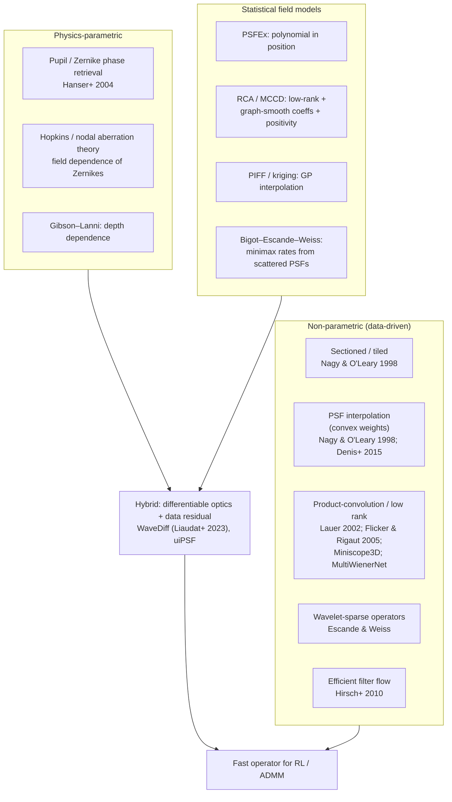
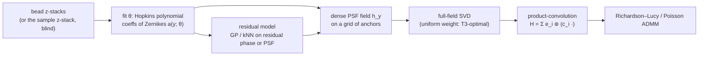
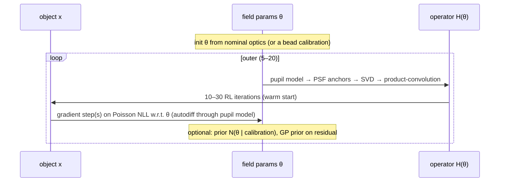
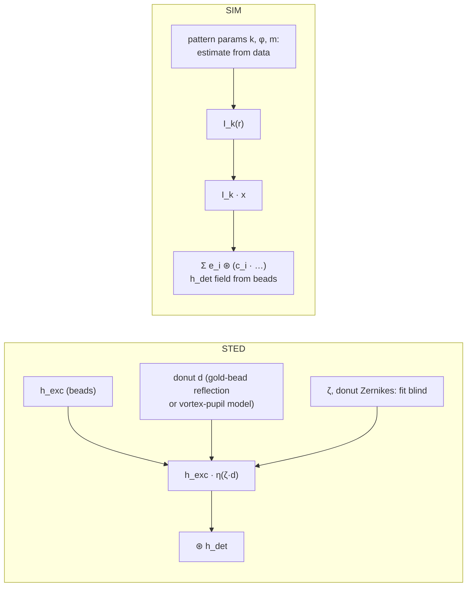

# Principled spatially varying deconvolution: research note

> **Question.** Is there something better than PCA eigen-PSFs of beads for spatially varying deconvolution?
> Are coefficient fields smooth? How do we do this **blind**? What about STED and SIM?
> **Companion docs.** Proofs in [`PROOFS.md`](PROOFS.md), checked by [`proofs/psf_field_proofs.py`](../proofs/psf_field_proofs.py).
> The framing log is in [`scratchpad.md`](scratchpad.md).
> Citations are numbered in [References](#references) and were checked against Crossref / arXiv / ADS.

---

## 1. Short answers

- **PCA isn't unprincipled, but it's the wrong model class.**
  - Computed over the *whole field*, PCA/SVD is exactly the Hilbert–Schmidt-optimal rank-r product-convolution operator ([T3](PROOFS.md#t3-pca-of-the-whole-field-is-the-hilbertschmidt-optimal-product-convolution-model)).
  - The PSF field, though, is a *curved 2-D surface* through pixel space, so its linear rank grows quickly: 27% HS error at rank 8 in our aberrated simulation.
  - PCA on *beads* also weights the field by wherever the beads happened to land.
- **Zernikes are weak as a PSF basis, strong as a parametrisation of *field dependence*.**
  - Hopkins' wave-aberration theory says each Zernike coefficient varies across the field as a **low-order polynomial** in field position (Seidel: `const`, `|y|`, `|y|²`, `|y|³`).
  - Nodal aberration theory extends this to misaligned systems.
  - A 5-parameter field fit from **8 beads** gave 0.6% field error; kNN interpolation from 200 beads gave 15% ([T6](PROOFS.md#t6-identifiability-and-the-parametric-physics-fit)).
- **Your smoothness conjecture is true, and short to prove.**
  - For *any fixed* orthonormal basis, `|c_i(y) − c_i(y')| ≤ ‖h_y − h_y'‖₂`, and a pupil model gives `‖h_y − h_y'‖₁ ≤ 2‖a(y) − a(y')‖₂` ([T1, T2](PROOFS.md#t1-phase-to-psf-is-2-lipschitz-l1-psf-vs-rms-phase)).
  - *But* polynomial structure is **not** inherited by PCA coefficients. Only the Zernike coefficients are polynomial in `y`.
- **Statistical PSF-field modelling is mature in astronomy.** PSFEx (polynomials), RCA/MCCD (low-rank + graph-smooth + positive), PIFF (Gaussian-process interpolation) and WaveDiff (differentiable optics + data-driven residual) are the closest prior art. On the theory side, Bigot–Escande–Weiss give **minimax rates** for estimating an operator from scattered impulse responses (i.e. beads).
- **Blind deconvolution becomes well-posed once the PSF family is low-dimensional *and* you have diversity.**
  - In focus, the signs of the even aberrations are exactly unidentifiable ([T6](PROOFS.md#t6-identifiability-and-the-parametric-physics-fit)).
  - A widefield **z-stack is phase diversity** for free.
  - So jointly estimate the object plus ~5–20 physical parameters, not a free-form PSF.
- **STED and SIM:** factor the effective PSF into **measurable physics** plus **a few scalars** you can fit blind.
  - **STED:** excitation PSF × saturation-suppression of the donut; unknowns are `ζ` and a few donut aberrations (Antonello 2017 [47]: only a few low-order modes fill the zero). Blind, spatially varying STED looks like an open gap.
  - **SIM:** detection PSF ⊛ (known-form illumination × object). This is *already* a product-convolution, so it fits this repo's framework directly. Spatial variation is currently handled by tiling (Hoffman & Betzig 2020 [52]); a smooth parameter field looks open.

---

## 2. How spatially varying blur is represented in the literature

| Family | Model of `h_y` | Strength | Weakness |
|---|---|---|---|
| Tiles | constant per tile | trivial | seams; no smoothness |
| Convex PSF interpolation | `Σ_b w_b(y) h_b` | keeps positivity and unit mass; error ≤ `2L_a`·spacing ([T5](PROOFS.md#t5-interpolation-error-from-beads)) | first order only; needs dense beads |
| Product-convolution (PCA/SVD) | `Σ_i c_i(y) e_i` | HS-optimal linear model ([T3](PROOFS.md#t3-pca-of-the-whole-field-is-the-hilbertschmidt-optimal-product-convolution-model)); fast via FFT ([T4](PROOFS.md#t4-product-convolution-operator-and-adjoint-what-richardsonlucy-needs)) | rank grows with aberration strength; bead-weighted |
| Statistical fields (RCA, GP) | low-rank with smooth / GP coefficients | uncertainty; smoothness prior | no physics; positivity must be enforced |
| **Physics (pupil + Hopkins)** | `|𝓕[P e^{iΣ a_j(y) Z_j}]|²`, `a_j` polynomial | ~5–20 parameters; data-efficient; interpretable | misspecification bias ([T6](PROOFS.md#t6-identifiability-and-the-parametric-physics-fit)); nonconvex fit |
| **Hybrid** | physics + non-parametric residual | error → 0 with more beads; data-efficient | more machinery |

---

## 3. Statistics-based PSF variation (the astronomy playbook)

Wide-field weak-lensing surveys need PSFs at *every* galaxy but measure them only at *stars*, the
exact analogue of beads. Their approaches, from least to most principled:

1. **Polynomial in position, per PSF pixel or per PCA coefficient** (PSFEx; Jee+ 2007 for HST/ACS). This is effectively what `impute_psfs(method="poly")` does. Limitation ([T2](PROOFS.md#t2-any-fixed-orthonormal-basis-inherits-the-fields-smoothness-your-conjecture)): coefficients are smooth but not polynomial.
2. **Gaussian-process / kriging interpolation** of PSF parameters (PIFF; Gentile+ 2013 compare interpolators). This gives *uncertainty*, which can be propagated into deconvolution as a PSF prior.
3. **Constrained matrix factorisation** (RCA, Ngolè+ 2016; MCCD).
   - Stack the observed PSFs as `M ≈ S A`.
   - `S` holds eigen-PSFs, sparse in wavelets and non-negative.
   - `A` holds coefficients constrained to be **smooth on the graph of star positions** (graph-Laplacian harmonics).
   - This is your PCA idea made principled: positivity + sparsity + an explicit spatial-smoothness prior.
4. **Differentiable optical model + data-driven correction** (WaveDiff, Liaudat+ 2023). Model the *wavefront*: a parametric Zernike field plus a learned, spatially smooth wavefront correction. Propagate through optics to pixels. **This is the closest published template for what this repo should become.**

**Theory:** Bigot, Escande and Weiss treat "estimate a spatially varying operator from a few scattered
impulse responses" as nonparametric regression. Under Sobolev smoothness of the field `y ↦ h_y`, their
estimator attains minimax rates. [T1](PROOFS.md#t1-phase-to-psf-is-2-lipschitz-l1-psf-vs-rms-phase) +
[T2](PROOFS.md#t2-any-fixed-orthonormal-basis-inherits-the-fields-smoothness-your-conjecture) are what
connect *optics* (smooth aberrations) to *their assumption* (a smooth PSF field). Debarnot, Escande,
Mangeat and Weiss then applied this line of work to **learning low-dimensional models of microscopes** from bead images.

---

## 4. Recommended model: physics-first hybrid PSF field

> **Prior art.** Physics-parametrised fields are *established*:
> - field-dependent pupils via Fourier ptychography (Zheng 2013; Chung 2016 [30, 31])
> - Seidel-coefficient fits in ring deconvolution [13]
> - field-dependent Zernikes in SMLM [33, 34]
> - wavefront-space hybrids in astronomy (WaveDiff [19])
>
> What this repo adds is the *proof chain* (T1–T6), a *controlled comparison* against the non-parametric family, and the *blind + diversity* formulation for widefield/STED/SIM.

1. **Parametrise the wavefront, not the pixels.**
   `a_j(y; θ) = Σ_{|α| ≤ d_j} θ_{jα} y^α`, with the degree `d_j` set by Hopkins order: defocus/astigmatism 2, coma 1 (3 at fifth order), spherical 0.
   - For misaligned systems, add the linear terms from nodal aberration theory.
   - Exclude tip/tilt: they are translations, handled by registration or absorbed by the object.
2. **Fit `θ` by Poisson likelihood** on bead z-stacks through a differentiable pupil model (PyTorch/JAX).
   - T6 shows a *known defocus diversity* is needed to fix the signs of the even aberrations.
   - Depth: add Gibson–Lanni / refractive-index-mismatch terms if imaging into the sample.
3. **Model the residual non-parametrically.** Fit a GP or convex-weight interpolation to the phase or PSF residual at beads. This removes misspecification bias as bead density grows (T6: 8.6% error from a deliberately misspecified model).
4. **Compress for speed.** Evaluate the fitted field on a *uniform* grid, take the SVD, and keep `r` components.
   - [T3](PROOFS.md#t3-pca-of-the-whole-field-is-the-hilbertschmidt-optimal-product-convolution-model) guarantees HS error `√Σ_{i>r} σ_i²`, so you *choose* `r` from a tolerance.
   - This is where PCA belongs: as an **operator compression** of a *model*, not as the model itself.
5. **Deconvolve** with RL using `H x = Σ e_i ⊛ (c_i · x)` and `Hᵀ y = Σ c_i · (e_i ⋆ y)` ([T4](PROOFS.md#t4-product-convolution-operator-and-adjoint-what-richardsonlucy-needs)). That is `r` FFT pairs per iteration.

**Error budget (in operator norm, per T1–T5):**
`‖H − Ĥ‖ ≤ model bias + estimation error (noise, beads) + truncation √Σ_{i>r} σ_i²`.
Each term is separately measurable: hold out beads, and read the SVD tail.

---

## 5. Blind (self-calibrated) spatially varying deconvolution

### Why naive blind fails
- **Trivial solution:** `h = δ`, `x = b`. A free-form PSF can always absorb the blur into the object.
- **Scale and shift:** `(αx, h/α)` and `(x(· − s), h(· + s))` give identical data. Fix the scale with `‖h‖₁ = 1` and drop tip/tilt.
- **Twin ambiguity** of even aberrations in focus: exact ([T6](PROOFS.md#t6-identifiability-and-the-parametric-physics-fit)).

### What makes it well-posed
1. **Low-dimensional physical PSF family.** A PSF field with ~5–20 parameters cannot collapse to `δ`.
2. **Diversity.** A widefield **z-stack is phase diversity** (Gonsalves 1982; Paxman+ 1992), because each plane adds a known defocus. 3-D blind deconvolution with a pupil-parametrised PSF has been done (Soulez+ 2012; Keuper+ 2013 regularise the OTF instead).
3. **Isolated point-like structure**, when present, anchors the PSF (Debarnot & Weiss study identifiability with isolated spikes). In practice: sparse puncta, vesicles, or beads spiked into the sample.

### Algorithm sketch (alternating, all Poisson)

- **Why it can work:** with `x` fixed, the `θ`-problem is a small nonlinear least-squares / Poisson fit, like T6. With `θ` fixed, the `x`-problem is ordinary non-blind RL.
- **Safeguards:** keep `θ` near a bead calibration taken on the same day (a Gaussian prior); stop RL early or add TV/Hessian regularisation on `x`; check by withholding a z-plane and predicting it.
- **Learned shortcut:** train a CNN to predict *local Zernike coefficients* from image patches, then run the non-blind solver (Shajkofci & Liebling 2020; Debarnot & Weiss "Deep-blur"). This is useful as an initialiser for the alternating scheme above.

---

## 6. Hard-to-measure PSFs: STED and SIM

**Principle.** Write the effective PSF as a composition of **measurable components** and **a few
unknown scalars**. Measure the components with beads, and estimate the scalars blind.

### STED
- **Model:** `h_STED(r) = h_exc(r) · η( ζ · d(r) ) ⊛ h_det` (confocal detection).
  - `d(r)` is the normalised depletion (donut) intensity; `ζ = I_max/I_sat` is the saturation factor.
  - `η` is the fluorescence-survival function: `≈ exp(−ln2 · s)` for pulsed and `≈ 1/(1+s)` for CW depletion, as a first approximation.
  - This gives the familiar resolution scaling `d ≈ λ / (2NA √(1+ζ))` (Harke+ 2008).
- **What is measurable:**
  - `h_exc` and `h_det`: confocal bead scans.
  - The donut `d(r)`: scanning a gold nanoparticle in reflection is the standard alignment check. It can also be *computed* from the pupil model with a vortex phase plate plus Zernike aberrations. T1 holds for any pupil, including a vortex.
- **What is hard:** `ζ`, and the donut's central zero, which aberrations (astigmatism, coma) fill in. Small fluorescent beads also bleach under STED.
- **So:** fit `ζ` (possibly field-varying) plus 3–6 donut Zernike coefficients **blind**, using the same alternating scheme. The family is tiny and physically constrained.
- **Field variation:** mostly from scan-lens off-axis aberration and depth. Use the §4 Hopkins polynomial on the *donut* pupil.

### SIM
- **Forward model:** `b_k = h_det ⊛ (I_k · x)`, for patterns `k = 1..K`. This **is** product-convolution, with the illumination `I_k` playing the role of the weight `c_i`.
  - With a varying detection PSF (§4): `b_k = Σ_i e_i ⊛ (c_i · I_k · x)`.
  - Multi-image Richardson–Lucy / EM handles this directly, with no Wiener/OTF-shift reconstruction and fewer artefacts at low SNR.
- **What is measurable:** `h_det`, from widefield beads under uniform illumination.
- **What is hard:** the pattern parameters: wave-vector, phase, modulation depth, and their *drift across the field*. Estimate them from the data (standard: fairSIM; Wicker-style phase estimation), locally per tile if they vary.
- **Fully unknown illumination:** blind-SIM (Mudry+ 2012; Labouesse+ 2017) jointly estimates the object and the speckle patterns. A Bayesian treatment is in Orieux+ 2012.

---

## 7. Suggested next steps for this repo

| # | Step | Deliverable | Test / evidence |
|---|---|---|---|
| 1 | Product-convolution RL in `jrl_impute.py` (FFT, `r` components) | `pc_forward`, `pc_adjoint`, `richardson_lucy_pc` | matches sparse `H` (as in T4); speed vs sparse at 512² |
| 2 | Differentiable pupil + Hopkins field fit (PyTorch) | `fit_field(beads_zstack) → θ` | recovers θ in simulation; bead hold-out error on `airy_get_psf.py` data |
| 3 | Residual GP on phase | `θ` + GP | error vs bead count converges to 0 under misspecification |
| 4 | Alternating blind 3-D | `blind_deconvolve(zstack, θ₀)` | simulated recovery; withheld-plane prediction on real data |
| 5 | STED / SIM forward models | `sted_psf(ζ, a)`, `sim_forward(I_k)` | simulation first; then gold-bead donut and fairSIM comparison |

---

## References

*Verification (2026-09-25):* all entries checked against Crossref / arXiv / ADS / publisher pages
(abstract level). ✎ marks entries corrected during verification.

**Spatially varying operators and PSF interpolation**
1. Nagy, J.G. & O'Leary, D.P. Restoring images degraded by spatially variant blur. *SIAM J. Sci. Comput.* 19(4):1063–1082, 1998. doi:10.1137/S106482759528507X
2. Lauer, T.R. Deconvolution with a spatially-variant PSF. *Proc. SPIE* 4847:167, 2002. doi:10.1117/12.461035. arXiv:astro-ph/0208247. *KL/PCA eigen-PSFs + RL: essentially this repo's original method.*
3. Flicker, R.C. & Rigaut, F.J. Anisoplanatic deconvolution of adaptive optics images. *JOSA A* 22(3):504–513, 2005. doi:10.1364/JOSAA.22.000504
4. Hirsch, M., Sra, S., Schölkopf, B. & Harmeling, S. Efficient filter flow for space-variant multiframe blind deconvolution. *CVPR* 2010, 607–614. doi:10.1109/CVPR.2010.5540158
5. Denis, L., Thiébaut, É., Soulez, F., Becker, J.-M. & Mourya, R. Fast approximations of shift-variant blur. *IJCV* 115(3):253–278, 2015. doi:10.1007/s11263-015-0817-x
6. ✎ Escande, P. & Weiss, P. Sparse wavelet representations of spatially varying blurring operators. *SIAM J. Imaging Sci.* 8(4):2976–3014, 2015. doi:10.1137/151003465
7. Escande, P. & Weiss, P. Approximation of integral operators using product-convolution expansions. *J. Math. Imaging Vis.* 58:333–348, 2017. doi:10.1007/s10851-017-0714-8. *Error bounds for exactly the T3/T4 operator.*
8. Bigot, J., Escande, P. & Weiss, P. Estimation of linear operators from scattered impulse responses. *Appl. Comput. Harmon. Anal.* 47(3):730–758, 2019. doi:10.1016/j.acha.2017.12.002. arXiv:1610.04056
9. Debarnot, V., Escande, P. & Weiss, P. A scalable estimator of sets of integral operators. *Inverse Problems* 35(10):105011, 2019. doi:10.1088/1361-6420/ab2fb3
10. Debarnot, V., Escande, P., Mangeat, T. & Weiss, P. Learning low-dimensional models of microscopes. *IEEE Trans. Comput. Imaging* 7:178–190, 2021. doi:10.1109/TCI.2020.3048295
11. Yanny, K. et al. Miniscope3D: optimized single-shot miniature 3D fluorescence microscopy. *Light Sci. Appl.* 9:171, 2020. doi:10.1038/s41377-020-00403-7
12. Yanny, K., Monakhova, K., Shuai, R.W. & Waller, L. Deep learning for fast spatially varying deconvolution. *Optica* 9(1):96–99, 2022. doi:10.1364/OPTICA.442438
13. Kohli, A. et al. Ring deconvolution microscopy: exploiting symmetry for efficient spatially varying aberration correction. *Nat. Methods*, 2025. doi:10.1038/s41592-025-02684-5. arXiv:2206.08928. **Prior art for Seidel/Hopkins-parametrised fields.**
14. Temerinac-Ott, M. et al. Multiview deblurring for 3-D images from light-sheet-based fluorescence microscopy. *IEEE TIP* 21(4):1863–1873, 2012. doi:10.1109/TIP.2011.2181528
15. Toader, B. et al. Image reconstruction in light-sheet microscopy: spatially varying deconvolution and mixed noise. *J. Math. Imaging Vis.* 64:968–992, 2022. doi:10.1007/s10851-022-01100-3

**Statistical PSF-field models (astronomy)**

16. Ngolè Mboula, F.M., Starck, J.-L., Okumura, K., Amiaux, J. & Hudelot, P. Constraint matrix factorization for space variant PSFs field restoration. *Inverse Problems* 32(12):124001, 2016. doi:10.1088/0266-5611/32/12/124001
17. ✎ Schmitz, M.A. et al. Euclid: Nonparametric point spread function field recovery through interpolation on a graph Laplacian. *A&A* 636:A78, 2020. doi:10.1051/0004-6361/201936094. *(RCA + graph-Laplacian interpolation; not MCCD.)*
18. ✎ Liaudat, T. et al. Multi-CCD modelling of the point spread function. *A&A* 646:A27, 2021. doi:10.1051/0004-6361/202039584. *(MCCD.)*
19. Liaudat, T., Starck, J.-L., Kilbinger, M. & Frugier, P.-A. Rethinking data-driven point spread function modeling with a differentiable optical model. *Inverse Problems* 39(3):035008, 2023. doi:10.1088/1361-6420/acb664. *(WaveDiff.)*
20. Liaudat, T.I., Starck, J.-L. & Kilbinger, M. Point spread function modelling for astronomical telescopes: a review focused on weak gravitational lensing studies. *Front. Astron. Space Sci.* 10:1158213, 2023. doi:10.3389/fspas.2023.1158213
21. Bertin, E. Automated morphometry with SExtractor and PSFEx. *ASP Conf. Ser.* 442:435, 2011. ADS 2011ASPC..442..435B
22. Jarvis, M. et al. Dark Energy Survey Year 3 results: point spread function modelling. *MNRAS* 501(1):1282–1299, 2021. doi:10.1093/mnras/staa3679. *(PIFF.)*
23. Gentile, M., Courbin, F. & Meylan, G. Interpolating point spread function anisotropy. *A&A* 549:A1, 2013. doi:10.1051/0004-6361/201219739. *RBF best, then IDW and kriging; global polynomials clearly worse.*
24. Jee, M.J. et al. Principal component analysis of the time- and position-dependent point-spread function of the Advanced Camera for Surveys. *PASP* 119:1403–1419, 2007. doi:10.1086/524849

**Optics: aberration theory and pupil models**

25. Hopkins, H.H. *Wave Theory of Aberrations.* Oxford: Clarendon Press, 1950.
26. ✎ Thompson, K. Description of the third-order optical aberrations of near-circular pupil optical systems without symmetry. *JOSA A* 22(7):1389–1401, 2005. doi:10.1364/JOSAA.22.001389
27. Hanser, B.M., Gustafsson, M.G.L., Agard, D.A. & Sedat, J.W. Phase-retrieved pupil functions in wide-field fluorescence microscopy. *J. Microsc.* 216(1):32–48, 2004. doi:10.1111/j.0022-2720.2004.01393.x
28. ✎ Gibson, S.F. & Lanni, F. Experimental test of an analytical model of aberration in an oil-immersion objective lens used in three-dimensional light microscopy. *JOSA A* 8(10):1601–1613, 1991. doi:10.1364/JOSAA.8.001601
29. Li, J., Xue, F. & Blu, T. Fast and accurate three-dimensional point spread function computation for fluorescence microscopy. *JOSA A* 34(6):1029–1034, 2017. doi:10.1364/JOSAA.34.001029
30. Zheng, G., Ou, X., Horstmeyer, R. & Yang, C. Characterization of spatially varying aberrations for wide field-of-view microscopy. *Opt. Express* 21:15131, 2013. doi:10.1364/OE.21.015131
31. Chung, J., Kim, J., Ou, X., Horstmeyer, R. & Yang, C. Wide field-of-view fluorescence image deconvolution with aberration-estimation from Fourier ptychography. *Biomed. Opt. Express* 7:352, 2016. doi:10.1364/BOE.7.000352
32. Xu, F. et al. Three-dimensional nanoscopy of whole cells and tissues with in situ point spread function retrieval. *Nat. Methods* 17:531–540, 2020. doi:10.1038/s41592-020-0816-x
33. Liu, S. et al. Universal inverse modeling of point spread functions for SMLM localization and microscope characterization. *Nat. Methods* 21:1082–1093, 2024. doi:10.1038/s41592-024-02282-x
34. Fu, S. et al. Field-dependent deep learning enables high-throughput whole-cell 3D super-resolution imaging. *Nat. Methods* 20:459–468, 2023. doi:10.1038/s41592-023-01775-5
35. Xiao, D. et al. Large-FOV 3D localization microscopy by spatially variant point spread function generation. *Sci. Adv.* 10:eadj3656, 2024. doi:10.1126/sciadv.adj3656
36. von Diezmann, L., Lee, M.Y., Lew, M.D. & Moerner, W.E. Correcting field-dependent aberrations with nanoscale accuracy in three-dimensional single-molecule localization microscopy. *Optica* 2(11):985–993, 2015. doi:10.1364/OPTICA.2.000985

**Blind deconvolution and phase diversity**

37. Gonsalves, R.A. Phase retrieval and diversity in adaptive optics. *Opt. Eng.* 21(5):829–832, 1982. doi:10.1117/12.7972989
38. Paxman, R.G., Schulz, T.J. & Fienup, J.R. Joint estimation of object and aberrations by using phase diversity. *JOSA A* 9(7):1072–1085, 1992. doi:10.1364/JOSAA.9.001072
39. Soulez, F., Denis, L., Tourneur, Y. & Thiébaut, É. Blind deconvolution of 3D data in wide field fluorescence microscopy. *IEEE ISBI* 2012, 1735–1738. doi:10.1109/ISBI.2012.6235915
40. Keuper, M. et al. Blind deconvolution of widefield fluorescence microscopic data by regularization of the optical transfer function (OTF). *CVPR* 2013, 2179–2186. doi:10.1109/CVPR.2013.283
41. Shajkofci, A. & Liebling, M. Spatially-variant CNN-based point spread function estimation for blind deconvolution and depth estimation in optical microscopy. *IEEE TIP* 29:5848–5861, 2020. doi:10.1109/TIP.2020.2986880
42. ✎ Debarnot, V. & Weiss, P. Deep-blur: blind identification and deblurring with convolutional neural networks. *Biological Imaging* 4:e13, 2024. doi:10.1017/S2633903X24000096
43. ✎ Debarnot, V. & Weiss, P. Blind inverse problems with isolated spikes. *Inf. Inference* 12(1):26–71, 2023. doi:10.1093/imaiai/iaac015
44. Kang, I. et al. Coordinate-based neural representations for computational adaptive optics in widefield microscopy. *Nat. Mach. Intell.* 6:714–725, 2024. doi:10.1038/s42256-024-00853-3. *(CoCoA.)*

**STED and SIM**

45. Harke, B. et al. Resolution scaling in STED microscopy. *Opt. Express* 16(6):4154–4162, 2008. doi:10.1364/OE.16.004154
46. Zanella, R. et al. Towards real-time image deconvolution: application to confocal and STED microscopy. *Sci. Rep.* 3:2523, 2013. doi:10.1038/srep02523
47. Antonello, J., Burke, D. & Booth, M.J. Aberrations in stimulated emission depletion (STED) microscopy. *Opt. Commun.* 404:203–209, 2017. doi:10.1016/j.optcom.2017.06.037
48. Mudry, E. et al. Structured illumination microscopy using unknown speckle patterns. *Nat. Photonics* 6:312–315, 2012. doi:10.1038/nphoton.2012.83
49. Labouesse, S. et al. Joint reconstruction strategy for structured illumination microscopy with unknown illuminations. *IEEE TIP* 26(5):2480–2493, 2017. doi:10.1109/TIP.2017.2675200
50. Orieux, F. et al. Bayesian estimation for optimized structured illumination microscopy. *IEEE TIP* 21(2):601–614, 2012. doi:10.1109/TIP.2011.2162741
51. Müller, M. et al. Open-source image reconstruction of super-resolution structured illumination microscopy data in ImageJ. *Nat. Commun.* 7:10980, 2016. doi:10.1038/ncomms10980
52. Hoffman, D.P. & Betzig, E. Tiled reconstruction improves structured illumination microscopy. *bioRxiv*, 2020. doi:10.1101/2020.01.06.895318 *(preprint)*

**Approximation theory**

53. ✎ Wendland, H. *Scattered Data Approximation.* Cambridge University Press, 2004. doi:10.1017/CBO9780511617539. *Sobolev `H^τ` interpolation: `L∞` error `O(h^{τ−d/2})`; `L2` rate `O(h^τ)` via Narcowich, Ward & Wendland, Math. Comp. 2005.*

*Removed as a spatially varying reference:* Preibisch et al. 2014 (multiview RL uses one shift-invariant PSF per view).
