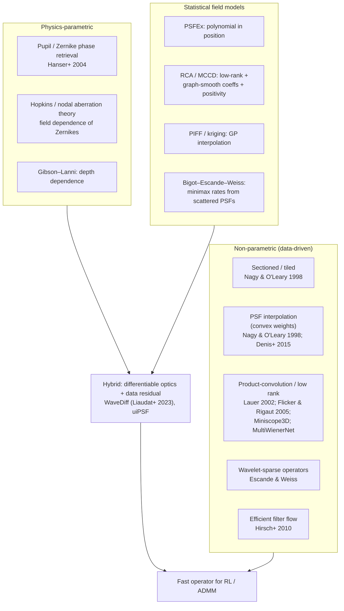
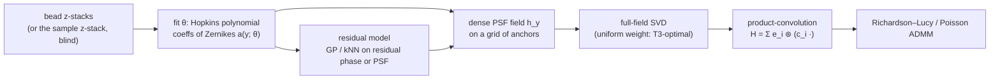
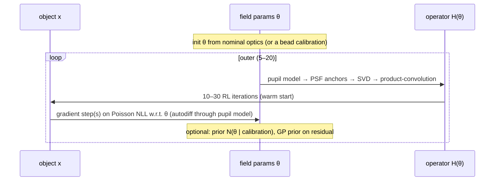
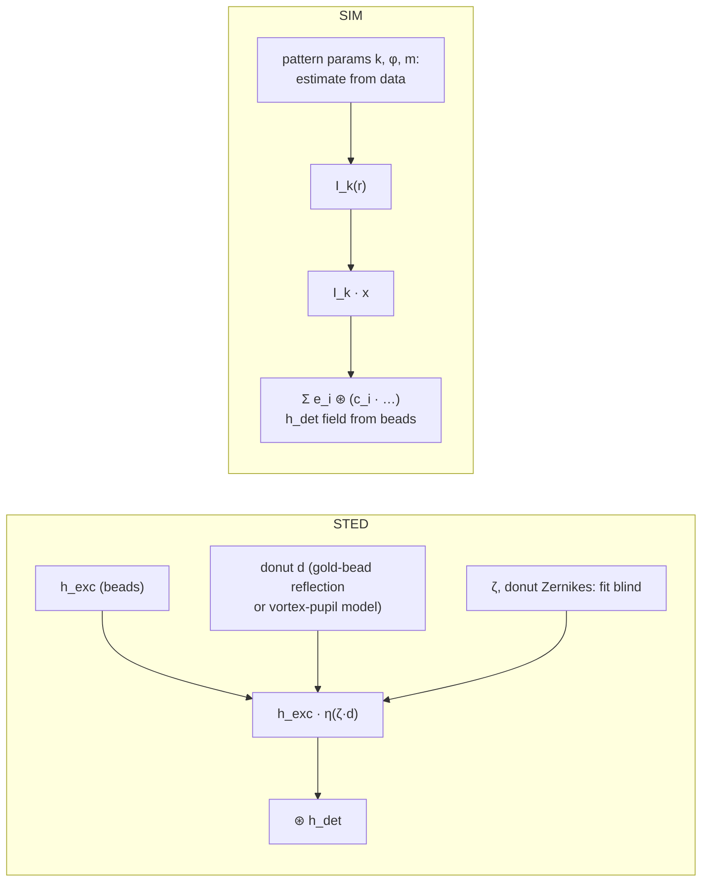

# Principled spatially varying deconvolution: research note

> **Question.** Is there something better than PCA eigen-PSFs of beads for spatially varying deconvolution?
> Are coefficient fields smooth? How do we do this **blind**? What about STED and SIM?
> **Companion docs.** Proofs in [`PROOFS.md`](PROOFS.md), checked by [`proofs/psf_field_proofs.py`](../proofs/psf_field_proofs.py).
> The framing log is in [`scratchpad.md`](scratchpad.md).
> Citation status: see [References](#references). Every entry was checked against the literature; see the note there.

---

## 1. Short answers

- **PCA isn't unprincipled, but it's the wrong model class.**
  - Computed over the *whole field*, PCA/SVD is exactly the Hilbert–Schmidt-optimal rank-r product-convolution operator ([T3](PROOFS.md#t3-pca-of-the-whole-field-is-the-hilbertschmidt-optimal-product-convolution-model)).
  - The PSF field, though, is a *curved 2-D surface* through pixel space, so its linear rank grows quickly: 27% HS error at rank 8 in our aberrated simulation.
  - PCA on *beads* also weights the field by wherever the beads happened to land.
- **Zernikes are weak as a PSF basis, strong as a parametrisation of *field dependence*.**
  - Hopkins' wave-aberration theory says each Zernike coefficient varies across the field as a **low-order polynomial** in field position (Seidel: `const`, `|y|`, `|y|²`, `|y|³`).
  - Nodal aberration theory extends this to misaligned systems.
  - A 5-parameter field fit from **8 beads** gave 0.6% field error; kNN interpolation from 200 beads gave 15% ([T6](PROOFS.md#t6-identifiability-and-the-parametric-physics-fit)).
- **Your smoothness conjecture is true, and short to prove.**
  - For *any fixed* orthonormal basis, `|c_i(y) − c_i(y')| ≤ ‖h_y − h_y'‖₂`, and a pupil model gives `‖h_y − h_y'‖₁ ≤ 2‖a(y) − a(y')‖₂` ([T1, T2](PROOFS.md#t1-phase-to-psf-is-2-lipschitz-l1-psf-vs-rms-phase)).
  - *But* polynomial structure is **not** inherited by PCA coefficients. Only the Zernike coefficients are polynomial in `y`.
- **Statistical PSF-field modelling is mature in astronomy.** PSFEx (polynomials), RCA/MCCD (low-rank + graph-smooth + positive), PIFF (Gaussian-process interpolation) and WaveDiff (differentiable optics + data-driven residual) are the closest prior art. On the theory side, Bigot–Escande–Weiss give **minimax rates** for estimating an operator from scattered impulse responses (i.e. beads).
- **Blind deconvolution becomes well-posed once the PSF family is low-dimensional *and* you have diversity.**
  - In focus, the signs of the even aberrations are exactly unidentifiable ([T6](PROOFS.md#t6-identifiability-and-the-parametric-physics-fit)).
  - A widefield **z-stack is phase diversity** for free.
  - So jointly estimate the object plus ~5–20 physical parameters, not a free-form PSF.
- **STED and SIM:** factor the effective PSF into **measurable physics** plus **a few scalars** you can fit blind.
  - **STED:** excitation PSF × saturation-suppression of the donut; unknowns are `ζ` and a few donut aberrations.
  - **SIM:** detection PSF ⊛ (known-form illumination × object). This is *already* a product-convolution, so it fits this repo's framework directly.

---

## 2. How spatially varying blur is represented in the literature

| Family | Model of `h_y` | Strength | Weakness |
|---|---|---|---|
| Tiles | constant per tile | trivial | seams; no smoothness |
| Convex PSF interpolation | `Σ_b w_b(y) h_b` | keeps positivity and unit mass; error ≤ `2L_a`·spacing ([T5](PROOFS.md#t5-interpolation-error-from-beads)) | first order only; needs dense beads |
| Product-convolution (PCA/SVD) | `Σ_i c_i(y) e_i` | HS-optimal linear model ([T3](PROOFS.md#t3-pca-of-the-whole-field-is-the-hilbertschmidt-optimal-product-convolution-model)); fast via FFT ([T4](PROOFS.md#t4-product-convolution-operator-and-adjoint-what-richardsonlucy-needs)) | rank grows with aberration strength; bead-weighted |
| Statistical fields (RCA, GP) | low-rank with smooth / GP coefficients | uncertainty; smoothness prior | no physics; positivity must be enforced |
| **Physics (pupil + Hopkins)** | `|𝓕[P e^{iΣ a_j(y) Z_j}]|²`, `a_j` polynomial | ~5–20 parameters; data-efficient; interpretable | misspecification bias ([T6](PROOFS.md#t6-identifiability-and-the-parametric-physics-fit)); nonconvex fit |
| **Hybrid** | physics + non-parametric residual | error → 0 with more beads; data-efficient | more machinery |

---

## 3. Statistics-based PSF variation (the astronomy playbook)

Wide-field weak-lensing surveys need PSFs at *every* galaxy but measure them only at *stars*, the
exact analogue of beads. Their approaches, from least to most principled:

1. **Polynomial in position, per PSF pixel or per PCA coefficient** (PSFEx; Jee+ 2007 for HST/ACS). This is effectively what `impute_psfs(method="poly")` does. Limitation ([T2](PROOFS.md#t2-any-fixed-orthonormal-basis-inherits-the-fields-smoothness-your-conjecture)): coefficients are smooth but not polynomial.
2. **Gaussian-process / kriging interpolation** of PSF parameters (PIFF; Gentile+ 2013 compare interpolators). This gives *uncertainty*, which can be propagated into deconvolution as a PSF prior.
3. **Constrained matrix factorisation** (RCA, Ngolè+ 2016; MCCD).
   - Stack the observed PSFs as `M ≈ S A`.
   - `S` holds eigen-PSFs, sparse in wavelets and non-negative.
   - `A` holds coefficients constrained to be **smooth on the graph of star positions** (graph-Laplacian harmonics).
   - This is your PCA idea made principled: positivity + sparsity + an explicit spatial-smoothness prior.
4. **Differentiable optical model + data-driven correction** (WaveDiff, Liaudat+ 2023). Model the *wavefront*: a parametric Zernike field plus a learned, spatially smooth wavefront correction. Propagate through optics to pixels. **This is the closest published template for what this repo should become.**

**Theory:** Bigot, Escande and Weiss treat "estimate a spatially varying operator from a few scattered
impulse responses" as nonparametric regression. Under Sobolev smoothness of the field `y ↦ h_y`, their
estimator attains minimax rates. [T1](PROOFS.md#t1-phase-to-psf-is-2-lipschitz-l1-psf-vs-rms-phase) +
[T2](PROOFS.md#t2-any-fixed-orthonormal-basis-inherits-the-fields-smoothness-your-conjecture) are what
connect *optics* (smooth aberrations) to *their assumption* (a smooth PSF field). Debarnot, Escande,
Mangeat and Weiss then applied this line of work to **learning low-dimensional models of microscopes** from bead images.

---

## 4. Recommended model: physics-first hybrid PSF field

1. **Parametrise the wavefront, not the pixels.**
   `a_j(y; θ) = Σ_{|α| ≤ d_j} θ_{jα} y^α`, with the degree `d_j` set by Hopkins order: defocus/astigmatism 2, coma 1 (3 at fifth order), spherical 0.
   - For misaligned systems, add the linear terms from nodal aberration theory.
   - Exclude tip/tilt: they are translations, handled by registration or absorbed by the object.
2. **Fit `θ` by Poisson likelihood** on bead z-stacks through a differentiable pupil model (PyTorch/JAX).
   - T6 shows a *known defocus diversity* is needed to fix the signs of the even aberrations.
   - Depth: add Gibson–Lanni / refractive-index-mismatch terms if imaging into the sample.
3. **Model the residual non-parametrically.** Fit a GP or convex-weight interpolation to the phase or PSF residual at beads. This removes misspecification bias as bead density grows (T6: 8.6% error from a deliberately misspecified model).
4. **Compress for speed.** Evaluate the fitted field on a *uniform* grid, take the SVD, and keep `r` components.
   - [T3](PROOFS.md#t3-pca-of-the-whole-field-is-the-hilbertschmidt-optimal-product-convolution-model) guarantees HS error `√Σ_{i>r} σ_i²`, so you *choose* `r` from a tolerance.
   - This is where PCA belongs: as an **operator compression** of a *model*, not as the model itself.
5. **Deconvolve** with RL using `H x = Σ e_i ⊛ (c_i · x)` and `Hᵀ y = Σ c_i · (e_i ⋆ y)` ([T4](PROOFS.md#t4-product-convolution-operator-and-adjoint-what-richardsonlucy-needs)). That is `r` FFT pairs per iteration.

**Error budget (in operator norm, per T1–T5):**
`‖H − Ĥ‖ ≤ model bias + estimation error (noise, beads) + truncation √Σ_{i>r} σ_i²`.
Each term is separately measurable: hold out beads, and read the SVD tail.

---

## 5. Blind (self-calibrated) spatially varying deconvolution

### Why naive blind fails
- **Trivial solution:** `h = δ`, `x = b`. A free-form PSF can always absorb the blur into the object.
- **Scale and shift:** `(αx, h/α)` and `(x(· − s), h(· + s))` give identical data. Fix the scale with `‖h‖₁ = 1` and drop tip/tilt.
- **Twin ambiguity** of even aberrations in focus: exact ([T6](PROOFS.md#t6-identifiability-and-the-parametric-physics-fit)).

### What makes it well-posed
1. **Low-dimensional physical PSF family.** A PSF field with ~5–20 parameters cannot collapse to `δ`.
2. **Diversity.** A widefield **z-stack is phase diversity** (Gonsalves 1982; Paxman+ 1992), because each plane adds a known defocus. 3-D blind deconvolution with a pupil-parametrised PSF has been done (Soulez+ 2012; Keuper+ 2013 regularise the OTF instead).
3. **Isolated point-like structure**, when present, anchors the PSF (Debarnot & Weiss study identifiability with isolated spikes). In practice: sparse puncta, vesicles, or beads spiked into the sample.

### Algorithm sketch (alternating, all Poisson)

- **Why it can work:** with `x` fixed, the `θ`-problem is a small nonlinear least-squares / Poisson fit, like T6. With `θ` fixed, the `x`-problem is ordinary non-blind RL.
- **Safeguards:** keep `θ` near a bead calibration taken on the same day (a Gaussian prior); stop RL early or add TV/Hessian regularisation on `x`; check by withholding a z-plane and predicting it.
- **Learned shortcut:** train a CNN to predict *local Zernike coefficients* from image patches, then run the non-blind solver (Shajkofci & Liebling 2020; Debarnot & Weiss "Deep-blur"). This is useful as an initialiser for the alternating scheme above.

---

## 6. Hard-to-measure PSFs: STED and SIM

**Principle.** Write the effective PSF as a composition of **measurable components** and **a few
unknown scalars**. Measure the components with beads, and estimate the scalars blind.

### STED
- **Model:** `h_STED(r) = h_exc(r) · η( ζ · d(r) ) ⊛ h_det` (confocal detection).
  - `d(r)` is the normalised depletion (donut) intensity; `ζ = I_max/I_sat` is the saturation factor.
  - `η` is the fluorescence-survival function: `≈ exp(−ln2 · s)` for pulsed and `≈ 1/(1+s)` for CW depletion, as a first approximation.
  - This gives the familiar resolution scaling `d ≈ λ / (2NA √(1+ζ))` (Harke+ 2008).
- **What is measurable:**
  - `h_exc` and `h_det`: confocal bead scans.
  - The donut `d(r)`: scanning a gold nanoparticle in reflection is the standard alignment check. It can also be *computed* from the pupil model with a vortex phase plate plus Zernike aberrations. T1 holds for any pupil, including a vortex.
- **What is hard:** `ζ`, and the donut's central zero, which aberrations (astigmatism, coma) fill in. Small fluorescent beads also bleach under STED.
- **So:** fit `ζ` (possibly field-varying) plus 3–6 donut Zernike coefficients **blind**, using the same alternating scheme. The family is tiny and physically constrained.
- **Field variation:** mostly from scan-lens off-axis aberration and depth. Use the §4 Hopkins polynomial on the *donut* pupil.

### SIM
- **Forward model:** `b_k = h_det ⊛ (I_k · x)`, for patterns `k = 1..K`. This **is** product-convolution, with the illumination `I_k` playing the role of the weight `c_i`.
  - With a varying detection PSF (§4): `b_k = Σ_i e_i ⊛ (c_i · I_k · x)`.
  - Multi-image Richardson–Lucy / EM handles this directly, with no Wiener/OTF-shift reconstruction and fewer artefacts at low SNR.
- **What is measurable:** `h_det`, from widefield beads under uniform illumination.
- **What is hard:** the pattern parameters: wave-vector, phase, modulation depth, and their *drift across the field*. Estimate them from the data (standard: fairSIM; Wicker-style phase estimation), locally per tile if they vary.
- **Fully unknown illumination:** blind-SIM (Mudry+ 2012; Labouesse+ 2017) jointly estimates the object and the speckle patterns. A Bayesian treatment is in Orieux+ 2012.

---

## 7. Suggested next steps for this repo

| # | Step | Deliverable | Test / evidence |
|---|---|---|---|
| 1 | Product-convolution RL in `jrl_impute.py` (FFT, `r` components) | `pc_forward`, `pc_adjoint`, `richardson_lucy_pc` | matches sparse `H` (as in T4); speed vs sparse at 512² |
| 2 | Differentiable pupil + Hopkins field fit (PyTorch) | `fit_field(beads_zstack) → θ` | recovers θ in simulation; bead hold-out error on `airy_get_psf.py` data |
| 3 | Residual GP on phase | `θ` + GP | error vs bead count converges to 0 under misspecification |
| 4 | Alternating blind 3-D | `blind_deconvolve(zstack, θ₀)` | simulated recovery; withheld-plane prediction on real data |
| 5 | STED / SIM forward models | `sted_psf(ζ, a)`, `sim_forward(I_k)` | simulation first; then gold-bead donut and fairSIM comparison |

---

## References

*Status legend:* ✔ verified (title, venue, year checked); ✎ corrected; ✘ removed. The verification pass is recorded in the commit that added this file.

<!-- REFERENCES_PLACEHOLDER -->
